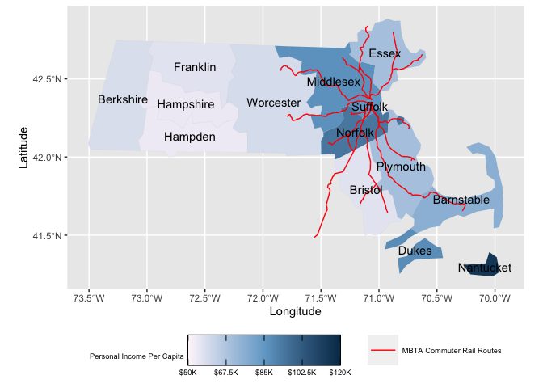

Mini Project 3
================

## Data

``` r
#importing data
MBTA_commuter_rail_routes <- "trains/" %>% 
  read_sf()
MA_personal_income_by_county <- read_csv("Per capita personal income by county.csv") 

#data wrangling 
MA_avg_personal_income <- MA_personal_income_by_county %>% 
  group_by(name) %>% 
  mutate( 
    income_averaged_by_years = (income_per_capita_2018 + income_per_capita_2019 + income_per_capita_2020)/3)

MA_counties <- USAboundaries::us_counties(resolution = "low", states = c("massachusetts")) %>% 
  select(-state_name)

MA_counties_and_income <- MA_counties %>% 
  inner_join(MA_avg_personal_income, by = "name") 

MA_counties_and_income <- MA_counties_and_income%>%
  mutate(
    lon = purrr::map_dbl(geometry, ~st_centroid(.x)[[1]]),
    lat = purrr::map_dbl(geometry, ~st_centroid(.x)[[2]]))
```

## MA Map

<!-- --> \`\`\`
